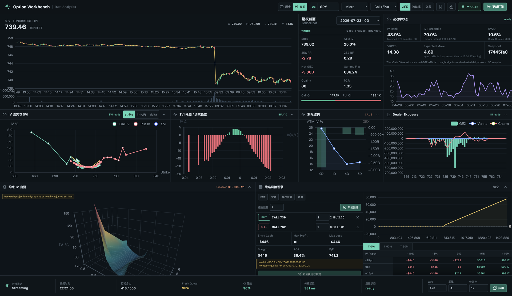
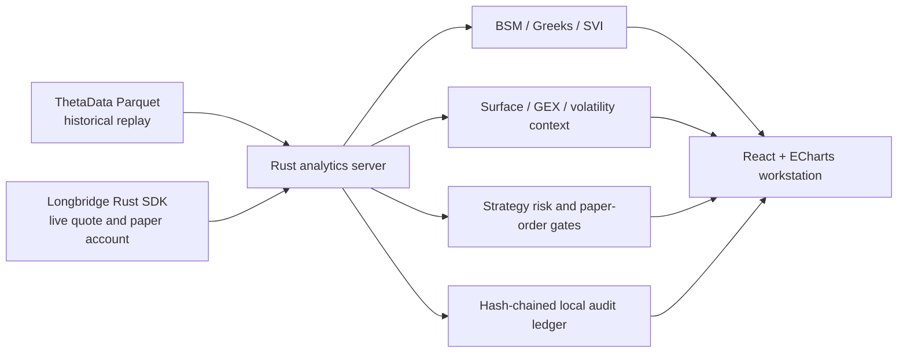

# Option Workstation

[](rust-backend/Cargo.toml)
[](rust-backend/Cargo.toml)
[](rust-backend/Cargo.toml)
[](frontend/package.json)
[](frontend/package.json)
[](frontend/package.json)
[](docs/DATA_SOURCES.md)
[](docs/DATA_SOURCES.md)
[](Dockerfile)
[](LICENSE)

Research-first options replay, volatility analytics, and guarded paper-trading
workstation.

[中文说明](README.md) · [Beginner guide](frontend/public/guide.html) ·
[Architecture](docs/ARCHITECTURE.md) · [Data contract](docs/DATA_SOURCES.md) ·
[Security](SECURITY.md)

Maintainer: [JIANGJINGZHE (Jiang Jingzhe / 江景哲)](mailto:jiangjingzhe2004@gmail.com) ·
[WhatsApp](https://wa.me/85268515553)



> [!WARNING]
> Option Workstation is pre-1.0 research software. It is not investment advice,
> an execution recommendation, or a guarantee of data quality, fills, profit, or
> loss. Real-money order submission is intentionally unsupported. Paper-order
> submission is locked off by default and still carries legging and partial-fill
> risk.

## Why This Exists

Options research often mixes delayed quotes, model outputs, and executable
prices without saying which is which. Option Workstation keeps those layers
visible:

- historical replay reads point-in-time local ThetaData Parquet partitions;
- live mode uses the official Longbridge Rust SDK and reports feed freshness;
- bid/ask availability, quote age, and metadata coverage remain explicit;
- BSM, SVI, surface projection, Greeks, GEX, IV/RV context, and strategy
  scenarios are calculated by the Rust server;
- strategy previews use executable NBBO sides instead of midpoint-only P&L;
- selected snapshots can be written to an append-only hash-chained audit ledger;
- paper execution requires several independent server-side gates.

The workstation is built for inspection and falsification. A polished surface is
not silently promoted to an arbitrage guarantee, and missing OI-dependent
metrics remain missing rather than being fabricated.

## Capabilities

| Area | Current capability | Trust boundary |
| --- | --- | --- |
| Historical replay | Multi-symbol intraday bars, option chains, expiries, synchronized stepping | Requires separately licensed ThetaData files |
| Live analytics | Longbridge quote/depth subscriptions and normalized WebSocket snapshots | Availability depends on account permissions and provider limits |
| Volatility | BSM IV/Greeks, matched-DTE IV history, RV5/10/20, VRP, expected move | BSM is a European approximation for American-listed options |
| Smile and surface | Call/put smile, SVI slice, residuals, term structure, constrained 3D projection | Projection is research-grade, not a mathematical no-arbitrage proof |
| Dealer exposure | GEX, vanna, charm, walls, gamma flip | Dealer sign convention is an assumption, not observed inventory |
| Strategy risk | Multi-leg executable entry/liquidation, expiry payoff, spot/IV/time matrix | Sequential legs are not exchange-atomic |
| Audit | Credential-redacted append-only JSONL hash chain | Local integrity aid, not an external timestamping authority |
| Trading | Account/order monitoring and guarded paper limits | Real-money submission is not supported |

The legacy Python API under `backend/` is retained only for migration parity.
The shipped application is served by `rust-backend/`.

## Architecture



The browser never reads local market-data files directly. The Rust process owns
provider contexts, calculations, freshness checks, execution gates, and audit
redaction. See [docs/ARCHITECTURE.md](docs/ARCHITECTURE.md) for the request and
trust flows.

## Quick Start

### Prerequisites

- Rust stable with `rustfmt` and `clippy`
- Node.js 22 and npm
- Python 3.11+ only if running the legacy parity tests
- a licensed replay dataset for historical mode
- optional Longbridge OpenAPI credentials for live mode

### Local

```bash
git clone <your-fork-or-repository-url> OptionWorkstation
cd OptionWorkstation
cp .env.example .env
```

Edit `OPTION_WORKSTATION_DATA_ROOT` in `.env` if you have replay data, then:

```bash
make setup
make run
```

Open <http://127.0.0.1:7311>. The service starts without market data, but the
historical catalog will be empty until a valid data root is mounted.

For a code-quality pass:

```bash
make check
make security
```

### Docker

```bash
cp .env.example .env
docker compose up --build
```

Compose publishes only `127.0.0.1:7311` by default, mounts replay data read-only,
and stores the audit ledger in a named volume. Set
`OPTION_WORKSTATION_DATA_ROOT` in `.env` before starting.

## Replay Data Contract

Market data is deliberately excluded from Git. The expected layout is:

```text
data/
├── underlying/
│   └── symbol=SPY/
│       └── date=2026-07-10/
│           └── ohlc.parquet
└── options/
    └── symbol=SPY/
        └── date=2026-07-10/
            └── expiration=2026-07-10/
                ├── quote_1m.parquet
                └── open_interest.parquet
```

Required column names, types, timestamps, point-in-time rules, and provider
licensing constraints are documented in
[docs/DATA_SOURCES.md](docs/DATA_SOURCES.md).

## Live Mode

1. Open the workstation and select **Live**.
2. Open the connection dialog.
3. Enter the Longbridge app key, app secret, and access token.
4. Connect, select an underlying and expiry, and wait for quality gates.

Credentials are sent only to the same-origin Rust API and held in SDK contexts
in process memory. They are never returned to the browser, persisted in local
storage, written to the repository, or accepted by audit records. Disconnecting
or stopping the process clears the in-memory session.

Do not expose the service to a network without adding authentication, TLS,
origin restrictions, and host-level access controls. The default binding is
loopback-only.

## Paper-Order Safety

Paper submission is disabled unless all of these conditions pass:

1. Longbridge identifies a paper account.
2. `OPTION_WORKSTATION_PAPER_ORDER_EXECUTION=1` is set on the server.
3. The strategy preview is fresh and executable.
4. The user types the exact confirmation `PAPER`.

Orders are regular-trading-hours day limits with deterministic request IDs.
Buy legs are submitted before sell legs; if a later submission fails, the
server requests cancellation of earlier legs. This is guarded sequential
execution, not exchange-atomic complex-order execution. Partial fills and
legging risk remain possible.

Real-money account order submission is rejected by design.

## Configuration

| Variable | Default | Purpose |
| --- | --- | --- |
| `OPTION_WORKSTATION_DATA_ROOT` | `./data` | Historical stock/options partitions |
| `OPTION_WORKSTATION_HOST` | `127.0.0.1` | HTTP/WebSocket bind host |
| `OPTION_WORKSTATION_PORT` | `7311` | HTTP/WebSocket port |
| `OPTION_WORKSTATION_RISK_FREE_RATE` | `0.043` | BSM risk-free rate |
| `OPTION_WORKSTATION_FRONTEND_DIST` | `./frontend/dist` | Built static frontend |
| `OPTION_WORKSTATION_AUDIT_PATH` | `~/.option-workstation/audit.jsonl` | Append-only research ledger |
| `OPTION_WORKSTATION_PAPER_ORDER_EXECUTION` | unset | Explicit paper-order server gate |
| `RUST_LOG` | `option_workstation=info,tower_http=info` | Runtime log filter |

Never place credentials in `.env`; the application accepts Longbridge
credentials through the local same-origin connection dialog only.

## API Surface

| Route | Method | Purpose |
| --- | --- | --- |
| `/api/health` | `GET` | Service and engine health |
| `/api/catalog` | `GET` | Available replay symbols and dates |
| `/api/session` | `GET` | Historical synchronized session |
| `/api/chain` | `GET` | Historical executable-price chain and quality gates |
| `/api/surface` | `GET` | Historical constrained surface and trust report |
| `/api/volatility-context` | `GET` | Point-in-time IV/RV/VRP/expected move |
| `/api/live/session` | `POST`, `DELETE` | Configure or disconnect live SDK session |
| `/api/live/snapshot` | `GET` | Current normalized live snapshot |
| `/api/live/stream` | `WS` | Throttled live snapshot stream |
| `/api/live/volatility-context` | `GET` | Live ATM IV and adjusted-close RV context |
| `/api/strategy/analyze` | `POST` | Multi-leg executable risk preview |
| `/api/audit/records` | `GET`, `POST` | Read or append redacted hash-chain records |
| `/api/trade/account` | `GET` | Read paper account state |
| `/api/trade/orders` | `GET`, `POST` | Read or guarded-submit paper orders |
| `/api/trade/orders/{order_id}` | `DELETE` | Request paper-order cancellation |

The API is local and pre-1.0. It is not yet covered by a compatibility promise.

## Verification

```bash
./scripts/verify.sh http://127.0.0.1:7311
RUN_BROWSER_SMOKE=1 ./scripts/verify.sh http://127.0.0.1:7311
node scripts/live-switch-smoke.mjs http://127.0.0.1:7311
node scripts/guide-smoke.mjs http://127.0.0.1:7311
```

`verify.sh` runs Rust formatting, unit tests, Clippy with warnings denied, and
the frontend production build. When a server is available, it also checks the
API. The optional browser smoke test verifies desktop/mobile overflow, nonblank
WebGL output, and 3D camera persistence. It never calls an order mutation route.

The live-switch smoke test requires an already connected in-memory Longbridge
session. It validates rate-limited symbol switching, continuity of the previous
stream while a switch is queued, SVI readiness, and the absence of ECharts
runtime errors.

## Model and Data Limits

- Listed US options are American-style. The BSM solver is a European
  approximation; dividend yield is inferred from paired put-call quotes when
  possible, otherwise cost of carry is used.
- The constrained total-variance projection reports price-space violations and
  adjustment counts. It is not labeled as a guaranteed arbitrage-free surface.
- OI-dependent PCR, GEX, walls, and gamma flip remain unavailable until metadata
  coverage reaches the configured quality threshold.
- IV Rank and IV Percentile use matched-DTE historical ATM IV and report the
  number and last date of observations.
- RV uses completed forward-adjusted daily closes before the active session.
- Expected move uses exact remaining time to the selected 16:00 ET expiry,
  including intraday 0DTE fractions.
- Displayed NBBO does not guarantee a fill. Wide, stale, and multi-leg markets
  can differ materially from modeled outcomes.

See [docs/MODEL_LIMITATIONS.md](docs/MODEL_LIMITATIONS.md) before interpreting
the analytics.

## Repository Layout

```text
frontend/       React, ECharts, ECharts-GL, guide, and UI smoke tests
rust-backend/   Axum API, Parquet replay, analytics, live SDK, audit, execution
vendor/         Audited source patches required by the locked dependency graph
backend/        Legacy Python parity reference; not used by the application
tests/          Legacy parity and no-data smoke tests
scripts/        Start, verification, browser, and publication checks
docs/           Architecture, data, development, model, and release standards
.github/        CI, dependency updates, issue forms, and PR template
```

## Project Standards

- Keep calculations deterministic and server-owned.
- Keep data provenance, quote age, sample count, and quality gates visible.
- Preserve point-in-time semantics; no future bars or future metadata in replay.
- Price long entries at ask and exits at bid unless a separate assumption is
  explicitly labeled.
- Never commit provider data, credentials, audit ledgers, account identifiers,
  or screenshots containing them.
- Add tests proportional to the risk of the change.
- Do not weaken paper-order gates to simplify demos.

Read [CONTRIBUTING.md](CONTRIBUTING.md) before opening a pull request.

## Open-Source Readiness

The repository includes:

- Apache-2.0 licensing and third-party notices;
- a code of conduct, contribution guide, security policy, and support policy;
- reproducible lockfiles, local and container startup paths;
- CI for Rust, frontend, Python reference smoke tests, dependency review, and
  credential scanning;
- Dependabot configuration for Cargo, npm, Docker, pip, and GitHub Actions;
- issue forms, a pull request checklist, and a release checklist;
- publication checks that reject personal paths, market-data files, oversized
  artifacts, and common credential material.

The locked Longbridge SDK currently requires a local `longbridge-oauth` patch
that upgrades its OAuth stack to `oauth2` 5.0. The source, upstream licenses,
and exact change scope are included in
[`vendor/longbridge-oauth`](vendor/longbridge-oauth). This patch should be
removed once an equivalent upstream release is available.

Before making a remote repository public, complete the maintainer-owned settings
in [docs/RELEASE_CHECKLIST.md](docs/RELEASE_CHECKLIST.md), including private
vulnerability reporting, branch protection, required checks, and repository
contact details.

## Contributing and Support

Contributions are welcome. Start with [CONTRIBUTING.md](CONTRIBUTING.md), follow
the [Code of Conduct](CODE_OF_CONDUCT.md), and use the issue forms for
reproducible bugs or data-quality reports. Security issues must follow
[SECURITY.md](SECURITY.md), not a public issue.

General support is described in [SUPPORT.md](SUPPORT.md). The project does not
provide personalized trading advice or compensate users for market losses.

## Maintainer

- **Maintainer:** JIANGJINGZHE (Jiang Jingzhe / 江景哲)
- **Email:** [jiangjingzhe2004@gmail.com](mailto:jiangjingzhe2004@gmail.com)
- **WhatsApp:** [+852 6851 5553](https://wa.me/85268515553)

Please prefer GitHub Issues for reproducible bugs, data-quality reports, and
feature proposals. Send credentials, account details, and vulnerability
reports only through a private channel, and never include licensed market data.

## License

Licensed under the [Apache License 2.0](LICENSE). Third-party components retain
their own licenses; see [THIRD_PARTY_NOTICES.md](THIRD_PARTY_NOTICES.md).

Market-data access and redistribution are governed separately by each provider's
terms. This repository does not grant rights to redistribute ThetaData,
Longbridge, exchange, or broker data.
