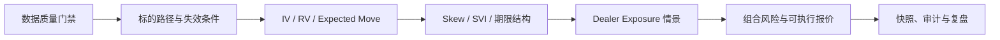
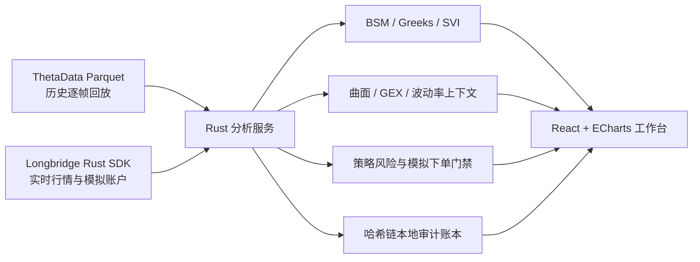

# Option Workstation

[](rust-backend/Cargo.toml)
[](rust-backend/Cargo.toml)
[](rust-backend/Cargo.toml)
[](frontend/package.json)
[](frontend/package.json)
[](frontend/package.json)
[](docs/DATA_SOURCES.md)
[](docs/DATA_SOURCES.md)
[](Dockerfile)
[](LICENSE)

一个面向期权研究者和交易员的本地工作台，把历史逐帧回放、实时期权链、
隐含波动率研究、Dealer Exposure、组合风险预览和可审计决策记录放在同一屏幕。
项目以数据来源透明、计算可复现和风险边界可见为首要原则。

[English](README.en.md) · [新手指南](frontend/public/guide.html) ·
[系统架构](docs/ARCHITECTURE.md) · [数据规范](docs/DATA_SOURCES.md) ·
[安全策略](SECURITY.md)

维护者：[JIANGJINGZHE（江景哲）](mailto:jiangjingzhe2004@gmail.com) ·
[WhatsApp](https://wa.me/85268515553)


> [!WARNING]
> 本项目仍处于 1.0 之前的研究阶段，不构成投资建议、下单建议或对行情质量、
> 成交结果、盈利和亏损的保证。项目不支持实盘账户下单。模拟下单默认关闭，
> 且即使开启，仍然存在多腿拆单、部分成交和滑点风险。

## 项目解决什么问题

很多期权工具会把延迟行情、模型推导值和真实可成交价格混在一起。
Option Workstation 刻意把这些层次拆开并显示出来：

- 历史模式直接读取本地 ThetaData Parquet 分区，按时间点回放；
- 实时模式使用 Longbridge 官方 Rust SDK，并显示行情新鲜度；
- Bid/Ask 可用性、报价年龄和 OI 元数据覆盖率不会被隐藏；
- BSM、SVI、Greeks、GEX、波动率上下文和曲面由 Rust 服务统一计算；
- 组合分析按可执行 NBBO 边计价，而不是只展示理想化中间价；
- 关键截面可以写入追加式 JSONL 哈希链，便于复盘与追责；
- 模拟下单由多个彼此独立的服务端门禁保护。

它首先是一个研究与证伪工具。图形看起来平滑，不代表曲面无套利；没有足够 OI
覆盖时，系统会保留空值，而不是补造 PCR、GEX、墙位或 Gamma Flip。

## 核心能力

| 模块 | 当前能力 | 必须知道的边界 |
| --- | --- | --- |
| 历史回放 | 多标的分钟线、期权链、到期日与同步步进 | 需要用户自行取得合法授权的数据 |
| 实时分析 | Longbridge 行情/深度订阅与本地 WebSocket | 受账号权限和供应商限频约束 |
| 波动率 | BSM IV/Greeks、同 DTE IV 历史、RV、VRP、Expected Move | BSM 对美式期权只是近似 |
| 微笑与曲面 | Call/Put 微笑、SVI、残差、期限结构和约束曲面 | 研究投影，不是严格无套利证明 |
| 暴露 | GEX、Vanna、Charm、墙位与 Gamma Flip | Dealer 符号是模型假设 |
| 组合风险 | 多腿可成交计价、到期损益与 Spot/IV/时间情景矩阵 | 多腿并非交易所原子撮合 |
| 审计 | 凭证字段拒绝、JSONL 哈希链 | 本地完整性辅助，不是第三方公证 |
| 交易 | 账户与订单监控、严格受控的模拟限价单 | 明确拒绝实盘账户下单 |

## 工作台功能详解

### 1. 行情与逐帧回放

- 历史模式按同一时间轴同步标的分钟线、成交量、期权链和多个到期日。
- 支持上一帧、下一帧、回到开盘、播放/暂停，以及 `0.5x` 到 `30x` 加速回放。
- 可在同一历史交易日加入多个标的，并在标的和到期日之间切换。
- 每一帧只使用当时已经可见的数据，避免把未来报价或未来 OI 带回当前截面。
- 实时模式通过本地 WebSocket 接收标准化快照，切换标的时保留旧流直到新订阅就绪。
- 3D 曲面视角与主要图表交互状态会在数据刷新时保留，不会不断复位。

你可以在不知道后续结果的前提下暂停市场、写下判断，再继续播放验证，
避免在收盘后用完整日线倒推一个看似合理的故事。

### 2. 期权截面与镜像期权链

- 展示 Spot、ATM IV、25 Delta Risk Reversal、25 Delta Butterfly、PCR、
  Net GEX、Gamma Flip 和快照标识。
- 镜像期权链同时展示 Call/Put 的 Bid、Ask、IV、Delta、OI 与执行价。
- 每个指标附带数据来源、报价新鲜度、样本覆盖和阻断原因。
- 支持 Micro、Mid 和 Ask 等观察口径，但组合风险默认使用可执行的买卖侧报价。
- 当双边 NBBO、OI 或元数据覆盖不足时，对应指标会显示不可用，而不是补造数值。

### 3. 波动率状态

- 使用 BSM 从市场价格反解 IV，并计算 Delta、Gamma、Theta 和 Vega。
- 比较当前 ATM IV 与相同剩余期限的历史 ATM IV，给出 IV Rank、
  IV Percentile、样本数和历史截止日期。
- 使用当前会话之前已经完成的前复权日线计算 RV5、RV10、RV20。
- 用 ATM IV 与 RV20 的差值观察 VRP20，并按剩余到期时间计算 Expected Move。
- 对 0DTE 使用距离纽约时间 16:00 收盘的实际剩余时间，而不是整日近似。

这些指标回答的是“市场为波动支付了多少价格”，不是“标的一定向哪边走”。

### 4. IV 微笑、SVI 与三维曲面

- IV 微笑可按执行价、`ln(K/F)` 和 Delta 三种横轴观察。
- 对单期限切片拟合 SVI，并同时显示 Call/Put 原始点、拟合线和残差。
- 报告 Butterfly、价格单调性、价格凸性和 Calendar 约束检查结果。
- 期限结构并排比较各到期日 ATM IV 与该期限的模型化 GEX。
- 约束总方差曲面同步呈现期限和虚实程度，并提供置信分、调整数量与
  `Trusted`/`Research` 状态。
- 原始报价稀疏、严重调整或约束失败时，曲面会降级为研究状态。

曲面用于发现结构、错位和数据问题，不代表已经证明存在无套利成交机会。

### 5. Dealer Exposure 情景

- 按执行价计算并联动展示 GEX、Vanna 和 Charm。
- 支持 `Call+/Put-`、Dealer Short、Dealer Long 三种持仓符号假设。
- 展示 Call Wall、Put Wall、Gamma Flip 和正负 Gamma 区域。
- 点击暴露图中的执行价，可把关注点同步到标的价格图和期权链。
- OI 覆盖没有达到门槛时，系统会整体阻断暴露类指标。

Dealer Exposure 描述的是在给定持仓假设下潜在的对冲机制，不是已知做市商库存，
也不应单独用作看涨或看跌信号。

### 6. 策略风险引擎

- 可直接从镜像期权链添加 Call/Put 多腿，调整买卖方向和合约数量。
- 根据每条腿的可执行 NBBO 计算建仓现金流、最大盈利、最大亏损、保证金、
  盈亏平衡点和模型 POP。
- 绘制到期损益线，并提供 Spot、IV 和剩余时间联动的情景矩阵。
- 对无双边报价、交叉市场、陈旧报价、过宽价差和低质量合约给出明确阻断。
- 提供跨式、宽跨、牛市价差和铁鹰预设，也可从同一期限链自由添加研究腿。
- 实时模式可进入严格受控的纸面订单流程；历史模式只允许研究和预览。

风险引擎的目标是回答“这个表达方式在什么条件下赚钱、最多可能损失多少、
当前报价能否执行”，而不是自动推荐策略。

### 7. 快照、比较与审计

- 可把当前标的、时间、到期日、波动率、暴露和策略状态导出为研究快照。
- 关键截面可写入追加式 JSONL 审计账本，记录之间使用哈希链连接。
- 审计接口拒绝凭证字段，避免把 App Secret 或 Access Token 写入研究记录。
- 可选择历史快照进行比较，观察 Spot、ATM IV、RR25 和 Net GEX 的变化。
- 本地账本适合个人复盘和变更追踪，但不替代第三方时间戳或合规档案系统。

### 8. 面向交易工作的界面

- `总览`、`波动率`、`交易` 三种布局用于不同阶段的关注重点。
- 面板可以折叠，允许在一个屏幕内同时观察更多同步图表。
- 底部状态栏持续显示行情状态、数据时间、订阅合约数、Fresh Quote、
  OI 覆盖、传输延迟和质量状态。
- 支持研究快照下载、审计书签、到期日切换和实时订阅预算调整。

## 两种运行模式

| 项目 | 历史回放 | 实时工作台 |
| --- | --- | --- |
| 数据来源 | 本地 ThetaData 风格 Parquet 分区 | Longbridge Rust SDK 行情与深度订阅 |
| 时间控制 | 手动逐帧、暂停、加速、回到开盘 | 随实时推送更新 |
| 标的范围 | 可加入多个已有数据的标的 | 一次维护一个活动标的及受限合约池 |
| 主要用途 | 学习、验证假设、事件复盘、策略研究 | 盘中观察、风险预览、纸面决策 |
| 交易能力 | 永远不提交订单 | 仅在全部门禁通过时允许模拟账户限价单 |
| 关键限制 | 依赖本地数据覆盖与 point-in-time 完整性 | 依赖账号权限、OPRA 权限、限频和网络质量 |

## 工作台如何辅助交易决策

Option Workstation 不输出简单的“买入”或“卖出”按钮。它把一次期权判断拆成七个
可以被检查和推翻的步骤：

1. **数据是否可信**：先看 Streaming、Fresh Quote、传输延迟、双边 NBBO 和
   OI 覆盖。质量门禁没有通过时停止解释模型。
2. **标的假设是什么**：明确预期上涨、下跌、震荡还是不确定，并写出价格失效点。
3. **正在交易方向还是波动率**：比较 ATM IV、IV Rank/Percentile、RV、VRP 和
   Expected Move，判断权利金是否已经包含过高预期。
4. **相对定价是否异常**：检查 RR、BF、微笑、SVI 残差和期限结构，先排除脏报价，
   再讨论某一翼或某一期限是否相对昂贵。
5. **对冲环境是否会放大风险**：把 GEX、Vanna、Charm 作为情景背景，观察潜在的
   稳定或放大机制，但不把 Dealer 假设当方向预测。
6. **策略是否准确表达假设**：比较单腿、价差、跨式和定义风险多腿结构的成本、
   Theta、Vega、盈亏平衡和尾部损失。
7. **当前是否真的可执行**：用每条腿 Bid/Ask、价差、最大损失和情景矩阵做最后否决，
   保存快照后再进入纸面观察。



当任一步骤缺少可靠输入时，正确结果可以是“不交易”。这也是工作台最重要的功能之一。

## 典型使用流程

### 历史研究

1. 选择交易日、标的和到期日，在播放前写下当日不应被未来数据影响的初始假设。
2. 从 09:30 ET 开始逐帧播放，在预设观察点暂停并记录 Spot、ATM IV、RR、VRP
   和数据质量。
3. 在不知道下一帧的情况下选择候选策略，记录其失效条件和最大风险。
4. 继续回放，区分错误来自方向、波动率定价、期限、结构、成交假设还是退出管理。
5. 保存关键快照，跨交易日比较同类市场状态，而不是只保留盈利案例。

### 实时观察

1. 连接 Longbridge 后先确认行情权限、Streaming 状态、延迟和报价覆盖。
2. 观察标的路径和成交量，再读取 IV、偏斜、期限结构及 Dealer 情景。
3. 从镜像期权链构造少量候选组合，用可执行报价淘汰成本或滑点不合理的结构。
4. 核对最大损失、情景矩阵和失效条件，保存研究快照。
5. 初学和研究阶段停在纸面预览；即使打开模拟执行，也必须人工确认。

## 技术架构



浏览器不直接读取本地行情文件。Rust 进程统一管理数据源 Context、计算、缓存、
新鲜度检查、交易门禁和审计脱敏；React 前端负责联动展示与交互。
详细请求流和信任边界见 [docs/ARCHITECTURE.md](docs/ARCHITECTURE.md)。

## 适用范围

适合：

- 学习期权 IV、Greeks、Skew、期限结构和组合损益；
- 对历史交易日做逐帧、不可偷看未来的复盘；
- 研究 0DTE 或短期期权的报价质量、波动率与执行风险；
- 在实时行情下统一观察多个相互关联的期权指标；
- 把交易假设、数据状态和风险预览留下可追踪记录。

不适合：

- 无人值守的实盘自动交易；
- 高频撮合、交易所共址或微秒级盘口策略；
- 把 GEX、PCR、SVI 残差或模型 POP 当成确定性信号；
- 在没有授权的情况下下载、传播或托管供应商行情数据；
- 代替券商风控、清算、合规系统或专业投资建议。

`backend/` 只保留为 Python 迁移对照。正式应用由 `rust-backend/` 提供服务。

## 快速启动

### 环境要求

- Rust stable，并安装 `rustfmt` 与 `clippy`
- Node.js 22 与 npm
- Python 3.11+，仅在运行旧 Python 对照测试时需要
- 历史模式需要用户自行准备合法授权的回放数据
- 实时模式可选 Longbridge OpenAPI 凭证

```bash
git clone <你的仓库或 fork 地址> OptionWorkstation
cd OptionWorkstation
cp .env.example .env
```

如果有历史数据，修改 `.env` 中的 `OPTION_WORKSTATION_DATA_ROOT`，然后：

```bash
make setup
make run
```

打开 <http://127.0.0.1:7311>。没有历史数据时服务仍可启动，但历史目录为空。

执行完整工程检查：

```bash
make check
make security
```

### Docker

```bash
cp .env.example .env
docker compose up --build
```

Compose 默认只绑定 `127.0.0.1:7311`，历史数据以只读方式挂载，审计记录保存在
独立 volume 中。

## 历史数据目录

```text
data/
├── underlying/
│   └── symbol=SPY/
│       └── date=2026-07-10/
│           └── ohlc.parquet
└── options/
    └── symbol=SPY/
        └── date=2026-07-10/
            └── expiration=2026-07-10/
                ├── quote_1m.parquet
                └── open_interest.parquet
```

字段、类型、时区、时间点规则和数据许可要求见
[docs/DATA_SOURCES.md](docs/DATA_SOURCES.md)。仓库会忽略所有 Parquet、Arrow
和 Feather 文件，不附带任何 ThetaData 或 Longbridge 数据。

## 实时连接

1. 进入工作台并切换到“实时”。
2. 打开连接面板。
3. 填入 Longbridge App Key、App Secret 和 Access Token。
4. 连接后选择标的与到期日，等待质量门禁通过。

凭证只发送给同源 Rust API，并由 SDK Context 保存在进程内存中。服务不会把凭证
返回浏览器、写进 localStorage、提交到审计记录或保存到仓库。断开连接或停止进程
后，内存会话即被清除。

不要直接把本服务暴露到公网。默认只监听本机回环地址；若确需网络访问，必须先补充
身份认证、TLS、Origin 限制和主机访问控制。

## 模拟下单门禁

必须同时满足以下条件，服务端才允许提交模拟订单：

1. Longbridge 返回模拟账户类型；
2. 服务端显式设置 `OPTION_WORKSTATION_PAPER_ORDER_EXECUTION=1`；
3. 当前组合预览仍然新鲜且具有可执行报价；
4. 用户输入完全一致的确认词 `PAPER`。

订单使用 RTH-only Day Limit，并带确定性的请求 ID。系统先提交买腿，再提交卖腿；
后续腿失败时会请求撤销前面已提交的腿。这不是交易所级别的原子多腿订单，因此仍有
部分成交、裸露风险和滑点。

## 环境变量

| 变量 | 默认值 | 作用 |
| --- | --- | --- |
| `OPTION_WORKSTATION_DATA_ROOT` | `./data` | 历史正股与期权分区 |
| `OPTION_WORKSTATION_HOST` | `127.0.0.1` | HTTP/WebSocket 监听地址 |
| `OPTION_WORKSTATION_PORT` | `7311` | 服务端口 |
| `OPTION_WORKSTATION_RISK_FREE_RATE` | `0.043` | BSM 无风险利率 |
| `OPTION_WORKSTATION_FRONTEND_DIST` | `./frontend/dist` | 前端构建目录 |
| `OPTION_WORKSTATION_AUDIT_PATH` | `~/.option-workstation/audit.jsonl` | 追加式审计记录 |
| `OPTION_WORKSTATION_PAPER_ORDER_EXECUTION` | 未设置 | 模拟下单服务端总开关 |
| `RUST_LOG` | `option_workstation=info,tower_http=info` | 日志过滤器 |

不要把 Longbridge 凭证写进 `.env`。本项目只通过本机同源连接面板接收凭证。

## 本地 API

| 路由 | 方法 | 用途 |
| --- | --- | --- |
| `/api/health` | `GET` | 服务、引擎和数据根目录健康状态 |
| `/api/catalog` | `GET` | 查询可回放的标的与日期 |
| `/api/session` | `GET` | 创建历史同步回放会话 |
| `/api/chain` | `GET` | 获取历史期权链、指标与质量门禁 |
| `/api/surface` | `GET` | 获取约束曲面及可信度报告 |
| `/api/volatility-context` | `GET` | 获取 point-in-time IV/RV/VRP/Expected Move |
| `/api/live/session` | `POST`, `DELETE` | 配置或断开实时 SDK 会话 |
| `/api/live/snapshot` | `GET` | 获取当前标准化实时快照 |
| `/api/live/stream` | `WS` | 接收节流后的实时快照流 |
| `/api/live/volatility-context` | `GET` | 获取实时 ATM IV 与历史 RV 上下文 |
| `/api/strategy/analyze` | `POST` | 计算多腿可执行价格与风险预览 |
| `/api/audit/records` | `GET`, `POST` | 读取或追加脱敏哈希链记录 |
| `/api/trade/account` | `GET` | 读取模拟账户状态 |
| `/api/trade/orders` | `GET`, `POST` | 查询或受控提交模拟订单 |
| `/api/trade/orders/{order_id}` | `DELETE` | 请求撤销模拟订单 |

API 当前只面向本地单用户环境，且仍处于 1.0 之前，不承诺向后兼容。

## 验证

```bash
./scripts/verify.sh http://127.0.0.1:7311
RUN_BROWSER_SMOKE=1 ./scripts/verify.sh http://127.0.0.1:7311
node scripts/live-switch-smoke.mjs http://127.0.0.1:7311
node scripts/guide-smoke.mjs http://127.0.0.1:7311
```

基础验证包含 Rust 格式检查、单元测试、Clippy 零警告和前端生产构建。浏览器测试
检查桌面/移动端溢出、WebGL 非空以及 3D 相机在数据刷新时不复位。所有自动化测试
都禁止调用订单变更接口。

## 模型边界

- 美股上市期权通常是美式期权，本地 BSM 是欧式近似。
- 约束总方差曲面会报告价格空间违规与调整数量，但不宣称严格无套利。
- Dealer GEX 符号不是可观测的真实库存。
- IV Rank/Percentile 只使用同 DTE 的历史 ATM IV，并显示样本数和最后日期。
- RV 只使用当前会话之前已经完成的前复权日线。
- 0DTE Expected Move 使用距离当日 16:00 ET 的精确剩余时间。
- 屏幕上的 NBBO 不保证成交，尤其是宽价差、陈旧报价和多腿组合。

更完整说明见 [docs/MODEL_LIMITATIONS.md](docs/MODEL_LIMITATIONS.md)。

## 开发规范

- 计算逻辑保持确定性，并由服务端统一负责。
- 数据来源、报价年龄、样本数和质量门禁必须可见。
- 历史回放必须保持 point-in-time 语义，禁止未来函数。
- 默认按买入 Ask、卖出 Bid 建模；其他假设必须单独标注。
- 禁止提交行情数据、凭证、审计账本、账户标识或包含这些内容的截图。
- 测试范围要与改动风险匹配。
- 不得为了演示方便削弱模拟下单门禁。

贡献前请阅读 [CONTRIBUTING.md](CONTRIBUTING.md)。开源发布前还需由维护者完成
[docs/RELEASE_CHECKLIST.md](docs/RELEASE_CHECKLIST.md) 中的 GitHub 仓库设置，
包括私密漏洞报告、分支保护和必需检查。

当前锁定的 Longbridge SDK 需要仓库内的 `longbridge-oauth` 安全补丁，以将
OAuth 依赖升级到 `oauth2` 5.0。补丁源码、上游许可证与变更范围均保存在
[`vendor/longbridge-oauth`](vendor/longbridge-oauth)；上游发布等效修复后应移除此补丁。

## 仓库结构

```text
frontend/       React、ECharts、ECharts-GL、初学者指南和浏览器测试
rust-backend/   Axum API、Parquet 回放、分析、实时 SDK、审计和执行门禁
vendor/         经过审计并记录移除条件的上游安全补丁
backend/        Python 迁移对照，不参与正式应用服务
tests/          Python 对照层和无行情数据 smoke tests
scripts/        启动、验证、浏览器回归和发布前安全检查
docs/           架构、数据、模型、开发、威胁模型和发布规范
.github/        CI、Dependabot、Issue 表单和 PR 模板
```

## 开源与贡献

仓库已经包含 Apache-2.0 许可证、第三方声明、行为准则、贡献规范、安全策略、
Dependabot、依赖审查、RustSec、秘密扫描、容器构建和发布检查。提交代码前请运行：

```bash
make check
make security
```

贡献流程见 [CONTRIBUTING.md](CONTRIBUTING.md)，支持边界见
[SUPPORT.md](SUPPORT.md)。安全问题不要创建公开 Issue，请按
[SECURITY.md](SECURITY.md) 私下报告。

## 维护者与联系

- **维护者**：JIANGJINGZHE（江景哲）
- **Email**：[jiangjingzhe2004@gmail.com](mailto:jiangjingzhe2004@gmail.com)
- **WhatsApp**：[+852 6851 5553](https://wa.me/85268515553)

功能问题、数据质量报告和改进建议优先使用 GitHub Issue，以便保留可检索的技术上下文。
涉及凭证、账户或安全漏洞的内容请通过 Email 私下联系，切勿发送真实行情授权数据。

## 许可证

项目使用 [Apache License 2.0](LICENSE)。第三方组件保留其原许可证，详见
[THIRD_PARTY_NOTICES.md](THIRD_PARTY_NOTICES.md)。

行情访问和再分发受各数据供应商协议单独约束。本仓库不会授予用户传播 ThetaData、
Longbridge、交易所或券商数据的权利。
