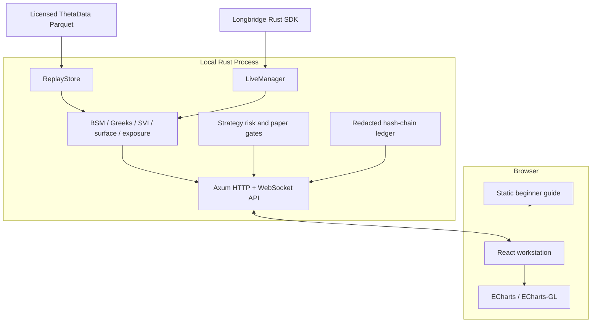
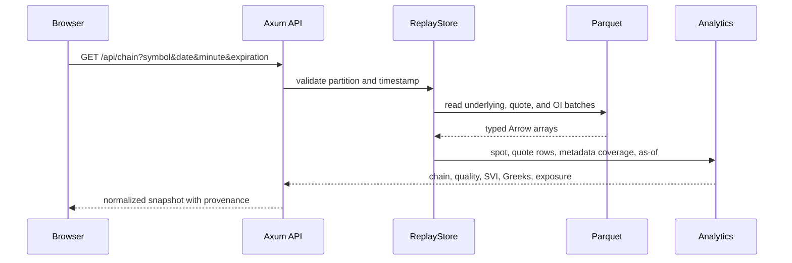
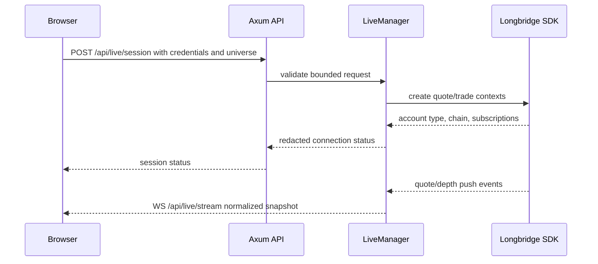

# Architecture

## Goals

Option Workstation is a local-first research application. Its architecture is
designed to keep market-data provenance, calculation ownership, and order
safety observable.

The core goals are:

- one deterministic Rust implementation for replay and live analytics;
- no provider credentials in browser storage or repository files;
- point-in-time replay over operator-owned local files;
- explicit quality gates instead of fabricated fallback metrics;
- no real-money order submission;
- UI refreshes that do not destroy the analyst's working context.

## Components

### Frontend

`frontend/` is a React 19 and Vite application. It renders the underlying tape,
chain, smile, SVI diagnostics, term structure, dealer exposure, constrained
surface, strategy builder, risk matrix, audit records, and account/order
monitor.

The browser receives normalized JSON snapshots. It does not parse Parquet,
calculate authoritative analytics, or own execution gates.

### Rust Server

`rust-backend/` is the production application:

- `main.rs`: API routes, configuration, static serving, and process lifecycle;
- `replay.rs`: partition discovery, Parquet decoding, and point-in-time reads;
- `live.rs`: Longbridge contexts, subscriptions, rate limits, cache, and paper
  account operations;
- `analytics.rs`: chain construction, IV/Greeks, quality, SVI, and exposure;
- `volatility.rs`: IV history, realized volatility, VRP, and expected move;
- `strategy.rs`: executable multi-leg risk and order-plan validation;
- `audit.rs`: credential-rejecting append-only hash-chain records;
- `models.rs`: transport and domain structures.

### Legacy Python Reference

`backend/` is a migration parity reference. It is not started by
`scripts/start.sh`, is not used by the React application, and must never receive
provider credentials. It may be removed after parity fixtures become fully
redistributable.

## Historical Request Flow

Replay caches are keyed by symbol, date, expiration, and minute. Cache entries
contain decoded market observations, not provider credentials or account data.

## Live Request Flow

Credentials are moved into SDK contexts and are not returned in status
responses. Live option-universe changes are serialized and rate-limited.
Failed switches attempt subscription rollback while preserving the previous
stream.

## Strategy and Paper-Order Flow

1. The browser selects legs from a server-produced chain.
2. `POST /api/strategy/analyze` recalculates entry cash, liquidation value,
   payoff, break-even, margin approximation, POP approximation, and scenarios.
3. The server binds the preview to current quote provenance and freshness.
4. Paper submission revalidates account type, server enablement, preview, and
   exact confirmation.
5. Legs are submitted sequentially with deterministic request IDs.
6. A later-leg failure triggers cancellation requests for earlier submitted
   legs.

The workflow is not atomic. The UI and documentation must continue to describe
legging and partial-fill risk.

## State and Persistence

| State | Location | Lifetime |
| --- | --- | --- |
| Longbridge credentials and SDK contexts | Rust process memory | until disconnect/process exit |
| Live quote/depth cache | Rust process memory | active process |
| Replay decoded cache | Rust process memory | active process |
| UI layout and collapsed panels | browser local storage | browser profile |
| Audit records | configured JSONL path | operator-managed |
| Historical data | configured local/mounted root | operator-managed |

## Compatibility

The local API is pre-1.0 and may change. Changes to routes, field semantics,
quality thresholds, or execution gates require tests, changelog notes, and
documentation updates.
