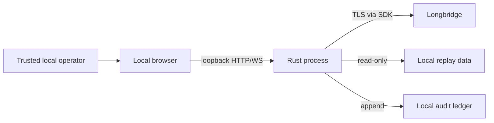

# Threat Model

## Supported Deployment

One trusted operator runs Option Workstation on a local machine. The browser and
Rust server share the same trusted operating-system account and communicate over
loopback.

## Assets

- Longbridge app key, app secret, and access token;
- paper account identity, balances, positions, and orders;
- licensed historical market data;
- audit records and saved research context;
- integrity of strategy previews and order gates.

## Trust Boundaries

The operating system, local browser profile, provider endpoints, and dependency
supply chain are separate trust boundaries.

## In-Scope Threats

- accidental credential persistence or logging;
- malicious payloads submitted to local API routes;
- stale strategy previews used for paper submission;
- incorrect account-type handling;
- duplicate order submission;
- live subscription failure leaving misleading UI state;
- audit payloads attempting to include secret fields;
- accidental publication of local paths, data, or credentials;
- vulnerable or malicious dependencies.

## Controls

- loopback-only default binding;
- same-origin credential flow and process-memory SDK contexts;
- credential-field rejection in audit payloads;
- explicit request bounds and typed request models;
- paper-account recognition, server enablement, freshness, and typed
  confirmation;
- deterministic request IDs and later-leg cancellation attempts;
- lockfiles, CI, dependency review, Dependabot, and secret scanning;
- ignored market-data/runtime formats and publication checks.

## Out-of-Scope Deployments

The project does not currently secure:

- public internet exposure;
- untrusted LAN users;
- multi-user tenancy;
- a compromised local OS or browser extension;
- remote credential vault integration;
- hostile provider or exchange infrastructure;
- real-money automated trading.

Such deployments need authentication, TLS, CSRF/origin controls, authorization,
rate limiting, external secret storage, hardened logging, and independent
security review.

## Residual Risk

Paper trades can still fill partially or at unexpected prices. Provider account
classification can change. Browser memory and process memory are readable by a
compromised local account. Hash-chained audit files can be truncated or replaced
without an external anchor. These limits must remain documented.
